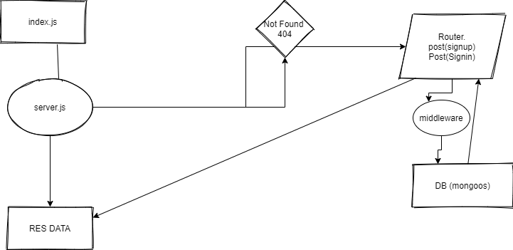

# basic-authapi-server Setup

Creating the repo on github.

Add Node CI

install packages

make model

make server

make db functions for the table

make the schema

make router put get post delete

res data from db

*URL's

[Heroku](https://ayoub-basic-auth.herokuapp.com/signup) 

[Action](https://github.com/ayoubkandah/data-structures-and-algorithms/actions)

[pull request](https://github.com/ayoubkandah/basic-auth/pull/1)

Visual Code
get UserName&Pass (signup)  ---> Store in DB by hash (signup)  ---> search inside DB for Username or Pass if exist (signin)-->return data or Invalid

wml

